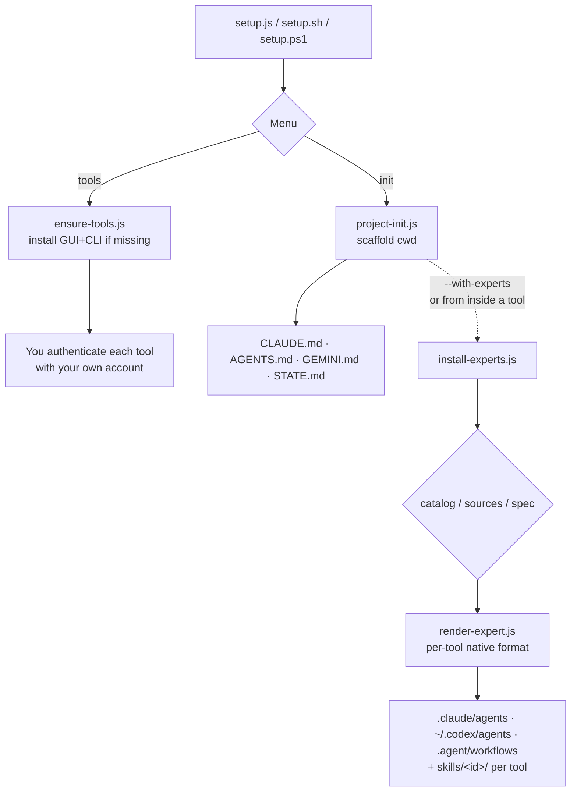
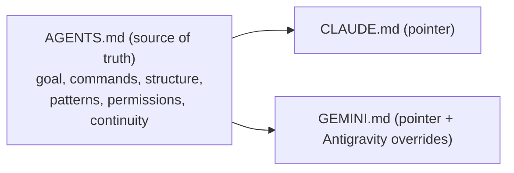
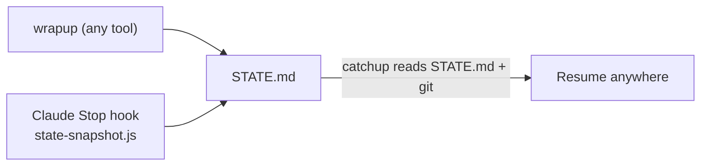
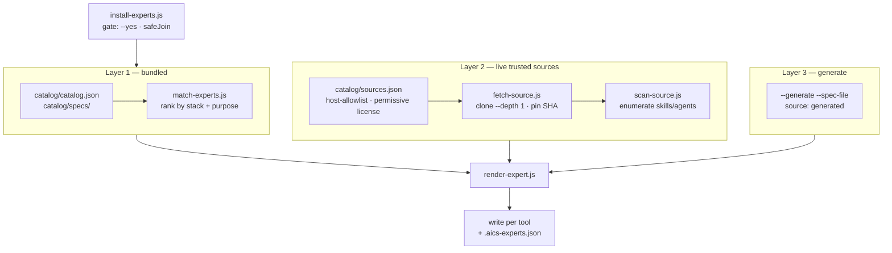

# Architecture

`ai-coding-stack` is a small, dependency-free Node toolkit with three jobs: **install** AI coding tools, **scaffold** projects for them, and **discover & install experts** (skills/agents) for each tool — plus session continuity.

## Tool install (ensure-tools.js)

Per-OS, data-driven. Detects the CLI (on PATH) and GUI (winget list / app dir); installs what's missing.

| Tool | GUI | CLI |
|------|-----|-----|
| Claude Code | `Anthropic.Claude` | `Anthropic.ClaudeCode` (`claude`) |
| Codex | (macOS-first; CLI covers Win/Linux) | `OpenAI.Codex` (`codex`) |
| opencode | — | `opencode-ai` (`opencode`) |
| Cursor | `Anysphere.Cursor` / `Cursor.app` | (app-based) |
| Windsurf | `Codeium.Windsurf` / `Windsurf.app` | (app-based) |
| Antigravity | `Google.Antigravity` | `Google.AntigravityCLI` (`agy`) |

Windows = winget (verified IDs); macOS = brew + app bundle detection; Linux = npm (GUIs: manual note).

## Context files — single source of truth

`AGENTS.md` is the cross-tool standard (Codex, Antigravity v1.20.3+, Cursor, opencode, Windsurf). Edit it once → every tool stays in sync. `CLAUDE.md` and `GEMINI.md` are short pointers.

## Continuity (context vs progress)

- **AGENTS.md** = *context* (what the project is). Static-ish, single source.
- **STATE.md** = *progress* (where you left off). Dynamic, shared by all tools.

## Stack detection (lib/detect-stack.js)

Reads `package.json` / `pyproject.toml` / `go.mod` / `Cargo.toml` / `pom.xml` / Gradle / Docker, plus IaC & scripts — **Terraform** (`*.tf` anywhere in the tree, incl. `modules/`/`environments/`), **Azure Bicep** (`*.bicep`), **Shell** (`*.sh`), and **Azure CLI / azd** (`azure.yaml` / `.azure/`) — → `{ languages, frameworks, commands{build,test,lint,dev}, suggestedProfile, isEmpty }`. Drives the real commands written into the context files (e.g. `terraform init/validate/fmt/plan`, `az bicep build/lint`, `shellcheck`).

## Expert discovery & MCP propagation (3 layers + env-interpolated MCP)

`project-init` can suggest and install best-fit **skills and agents** for the detected stack + purpose, rendered to each tool's native format. Three layers, quality-first: bundled offline catalog → live trusted sources → generate only for gaps.

`lib/propagate-mcp.js` writes shared MCP servers (e.g., Context7) into each tool's native MCP config using the tool's env-interpolation syntax (`{env:VAR}` for opencode/Cursor, `${env:VAR}` for Windsurf), so API keys live only in the environment, never on disk.

### Orchestration (install-experts.js)

`install-experts.js` resolves the selected tools, renders each expert via `render-expert.js`, and writes it to the right place. An **approval gate** means nothing is written unless `--yes` is passed (`--dry-run` / no `--yes` previews only). `safeJoin` resolves every destination under the tool's base dir and refuses any path that escapes it (defense-in-depth against traversal). Every install is recorded in a `.aics-experts.json` **provenance manifest** at the project root (`{ id, type, source, sourcePath, ref, installedAt, tools, layout }`).

`render-expert.js` holds the `TOOLS` map — the single source of truth for where files land and how agents render per tool:

| Tool | Scope | Agent path | Skill path | Notes |
|------|-------|-----------|-----------|-------|
| Claude Code | project (`.claude`) | `.claude/agents/<id>.md` | `.claude/skills/<id>/SKILL.md` | Native SKILL.md support |
| Codex | **global** (`~/.codex`) | `~/.codex/agents/<id>.toml` | `~/.codex/skills/<id>/SKILL.md` | Global (affects all projects) |
| opencode | project (cwd) | `.agents/<id>.md` | `.skills/<id>/SKILL.md` | Native SKILL.md support |
| Cursor | project (`.cursor`) | — (no agents) | `.cursor/rules/<id>.mdc` | Skills → rules |
| Windsurf | project (`.windsurf`) | `.windsurf/workflows/<id>.md` | `.windsurf/rules/<id>.md` | Agents → workflows; skills → rules |
| Antigravity | project (`.agent`) | `.agent/workflows/<id>.md` | `.agent/skills/<id>/SKILL.md` | — |

Skills render identically for tools with SKILL.md concept (Claude, Codex, opencode, Antigravity); Cursor/Windsurf map skills → rules. Agents render to each tool's native format. **Codex installs globally (`~/.codex`) — it affects every project on the machine**; the installer warns before writing.

### Layer 1 — bundled catalog (offline, instant)

- `catalog/catalog.json` lists vetted experts (`id`, `kind`, `profiles`, `languages`, `frameworks`, `keywords`); canonical specs live in `catalog/specs/`.
- `lib/match-experts.js` ranks experts against the detected stack + `--about` text (profile, language, framework, and keyword matches; pure function, no I/O).
- `lib/render-expert.js` renders each spec to a tool's native format — Claude `.claude/agents/*.md`, Codex `~/.codex/agents/*.toml` (**GLOBAL**), Antigravity `.agent/workflows/*.md`; skills go to each tool's `skills/<id>/`.

### Layer 2 — live trusted sources

- `catalog/sources.json` is an **allowlist** of 3 popular collections — each entry pins a `host`, `layout`, `paths`, and a permissive `license`:
  1. **wshobson-agents** (83 plugins: backend, frontend, data, DevOps, security, code review)
  2. **obra-superpowers-skills** (community skills: TDD, debugging, collaboration, architecture, workflow)
  3. **sickn33-antigravity-awesome-skills** (1.5k+ multi-tool SKILL.md library, best for data-ai/azure/RAG/ML; quality uneven — cherry-pick by tag)
- `lib/fetch-source.js` clones a source (`git clone --depth 1`), **pins the SHA**, enforces the host allowlist (exact HTTPS hostname, no port), **rejects symlinks**, and **never executes** repo contents. Returns `{ path, ref }`.
- `lib/scan-source.js` enumerates installable skills/agents in the fetched tree (glob/recursive-aware; layouts `skills-dir`, `agents-dir`, `claude-plugin-marketplace`).
- Install with `--source-id` / `--source-path` / `--layout` / `--ref` / `--pick <names>`. Only `SKILL.md` / agent `.md` text is used.
- Refresh later with `install-experts.js --update` (re-fetches latest, previews, requires `--yes`).

### Layer 3 — generate (only for gaps)

- When neither layer covers a niche need, the agent authors a canonical spec (frontmatter `id`/`kind`/`description` + body) to a temp file and installs it with `--generate --spec-file <path>`.
- Generated experts are recorded as `source: "generated"` and **skipped by `--update`** (there is nothing to re-fetch).
