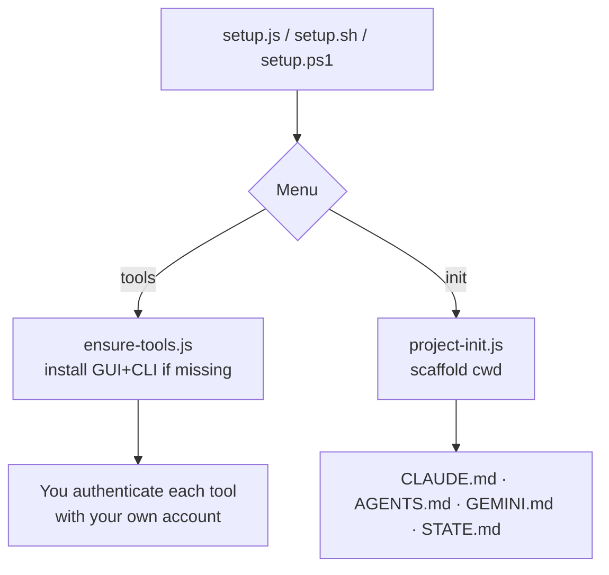
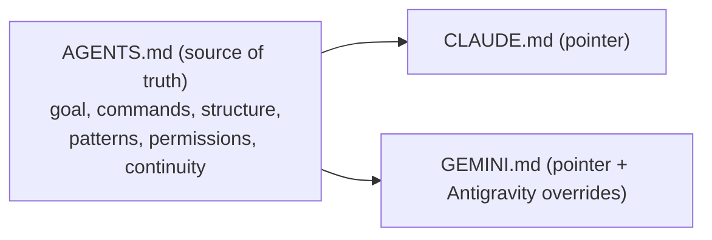
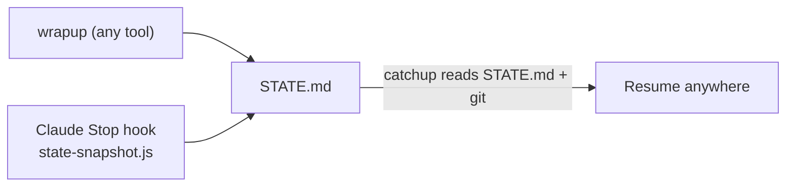

# Architecture

`ai-coding-stack` is a small, dependency-free Node toolkit with two jobs: **install** AI coding tools and **scaffold** projects for them — plus session continuity.

## Tool install (ensure-tools.js)

Per-OS, data-driven. Detects the CLI (on PATH) and GUI (winget list / app dir); installs what's missing.

| Tool | GUI | CLI |
|------|-----|-----|
| Claude Code | `Anthropic.Claude` | `Anthropic.ClaudeCode` (`claude`) |
| Codex | (macOS-first; CLI covers Win/Linux) | `OpenAI.Codex` (`codex`) |
| Antigravity | `Google.Antigravity` | `Google.AntigravityCLI` (`agy`) |

Windows = winget (verified IDs); macOS = brew/npm; Linux = npm (GUIs: manual note).

## Context files — single source of truth

`AGENTS.md` is the cross-tool standard (Codex, Antigravity v1.20.3+, Cursor). Edit it once → every tool stays in sync. `CLAUDE.md` and `GEMINI.md` are short pointers.

## Continuity (context vs progress)

- **AGENTS.md** = *context* (what the project is). Static-ish, single source.
- **STATE.md** = *progress* (where you left off). Dynamic, shared by all tools.

## Stack detection (lib/detect-stack.js)

Reads `package.json` / `pyproject.toml` / `go.mod` / `Cargo.toml` / `pom.xml` / Gradle / Docker / Terraform → `{ languages, frameworks, commands{build,test,lint,dev}, suggestedProfile, isEmpty }`. Drives the real commands written into the context files.
